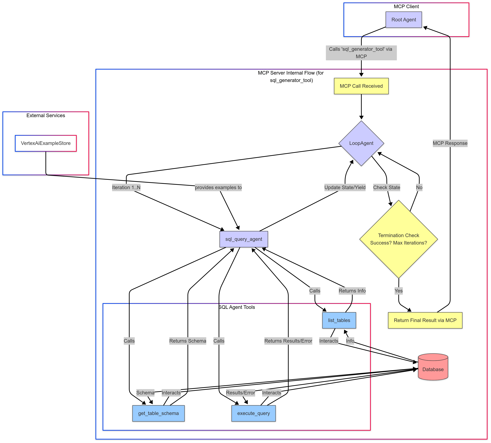

# SQL Database Agent with Google ADK Framework

This project implements an intelligent SQL agent that can interpret natural language queries about a database, translate them into SQL, execute them, and provide human-friendly responses using the Google ADK (Agent Development Kit) framework.

## Project Overview

The agent uses a combination of components:

- **Main Agent**: Handles natural language understanding and generates responses
- **SQL Query Tool**: A tool that generates and executes SQL queries
- **MCP Server**: Multi-Call Protocol server that provides tools to the main agent
- **Few-Shot Examples**: Pre-loaded examples to help improve SQL query generation
- **SQLite Database**: The Chinook music store sample database

## Features

- Natural language to SQL conversion
- Database schema introspection
- Error handling and query refinement
- Example-enhanced prompting for better SQL generation
- Conversational presentation of query results

## Prerequisites

- Python 3.10+
- Google Cloud account with Vertex AI API enabled
- Google Cloud authentication configured

## Installation

1. Clone this repository:
   ```bash
   git clone <repository-url>
   cd sql-database-agent
   ```

2. Install dependencies:
   ```bash
   pip install -r requirements.txt
   ```

3. Set up Google Cloud authentication:
   ```bash
   # Option 1: Set up Application Default Credentials
   gcloud auth application-default login

   # Option 2: Use a service account key
   export GOOGLE_APPLICATION_CREDENTIALS=/path/to/your/service-account-key.json
   ```

4. Configure environment variables in a `.env` file:
   ```
   GOOGLE_CLOUD_PROJECT=your-project-id
   # Optional: Pre-configured example store (after running ingestion)
   EXAMPLE_STORE=your-example-store-resource-name
   ```

## Running the Application

### Step 1: Prepare Few-Shot Examples (Optional)

To improve the agent's performance, you can ingest few-shot examples:

```bash
python ingest_examples.py --project your-project-id
```

After running, you'll get an example store resource name that you should set in your `.env` file.

### Step 2: Start the Agent

Run the main agent script:

```bash
python agent.py
```

This will initialize the agent and allow you to interact with it. The script includes a sample question to demonstrate functionality.

## Implementation Details

### Key Components

- **agent.py**: Main entry point and agent orchestration
- **sql_query_mcp_server.py**: MCP server that provides SQL tools
- **sqlite_database.py**: Database wrapper for the Chinook SQLite database
- **injest_examples.py**: Tool for ingesting few-shot examples

### Architecture

1. The user sends a natural language query
2. The main agent processes the query and calls the SQL tool
3. The SQL tool uses the MCP server to:
   - List tables and get schema information
   - Generate an appropriate SQL query
   - Execute the query against the database
4. The main agent interprets the results and responds in natural language

## Customization

### Using a Different Database

To use a different SQLite database:

1. Update the `setup_database` function in `sqlite_database.py`
2. Update the few-shot examples in `injest_examples.py` to match your schema

### Modifying Agent Behavior

You can adjust the agent's behavior by modifying the instructions in:

- `agent.py`: Change the main agent's instruction prompt
- `sql_query_mcp_server.py`: Modify the SQL generation agent's prompt